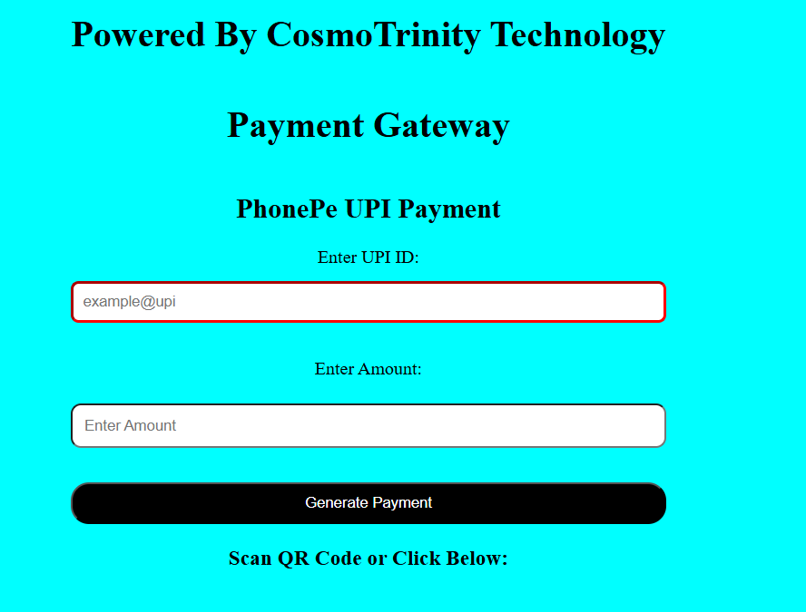
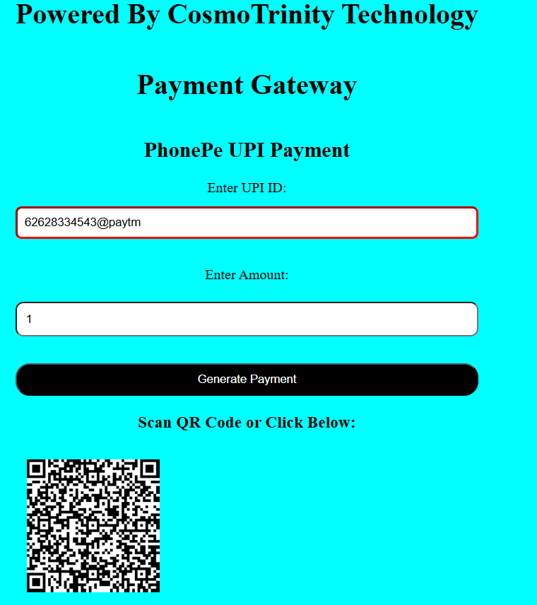

<h1 align="center">💳 UPI Payment Gateway UI</h1>

  A simple and clean UPI Payment Interface built using <b>HTML, CSS & JavaScript</b>.

<h2>🚀 Features</h2>
<ul>
  <li>🔹 Simple and clean UI design</li>
  <li>🔹 UPI ID input field</li>
  <li>🔹 Payment simulation interface</li>
  <li>🔹 Beginner-friendly project</li>
  <li>🔹 Fully responsive layout</li>
</ul>

<h2>🖼️ Preview</h2>

<h3>📌 Payment Gateway Screen</h3>

  

<h3>📌 After Entering UPI ID</h3>

  

<h2>⚙️ Tech Stack</h2>
<ul>
  <li>🌐 HTML5</li>
  <li>🎨 CSS3</li>
  <li>⚡ JavaScript</li>
</ul>

<h2>📂 Project Structure</h2>

<pre>
📁 UPI-Payment-Gateway
 ├── index.html
 ├── style.css
 ├── script.js
 ├── image.png
 └── image1.png
</pre>

<h2>🧠 How It Works</h2>
<ul>
  <li>1️⃣ User enters UPI ID</li>
  <li>2️⃣ Clicks on Pay button</li>
  <li>3️⃣ UI simulates payment process</li>
  <li>4️⃣ Shows confirmation screen</li>
</ul>

<h2>📌 How to Run</h2>

<pre>
1. Clone the repository
2. Open index.html in browser
3. Enter UPI ID
4. Simulate payment 🚀
</pre>

<h2 align="center">✨ Future Improvements</h2>
<ul>
  <li>🔹 Add real payment API integration</li>
  <li>🔹 Add QR code scanner</li>
  <li>🔹 Payment history tracking</li>
</ul>

<h2 align="center">🙌 Contributing</h2>

  Contributions are welcome! Feel free to fork and improve this project.

<h2 align="center">📬 Connect with Me</h2>

  Made with ❤️ by <b>Your Name</b>

